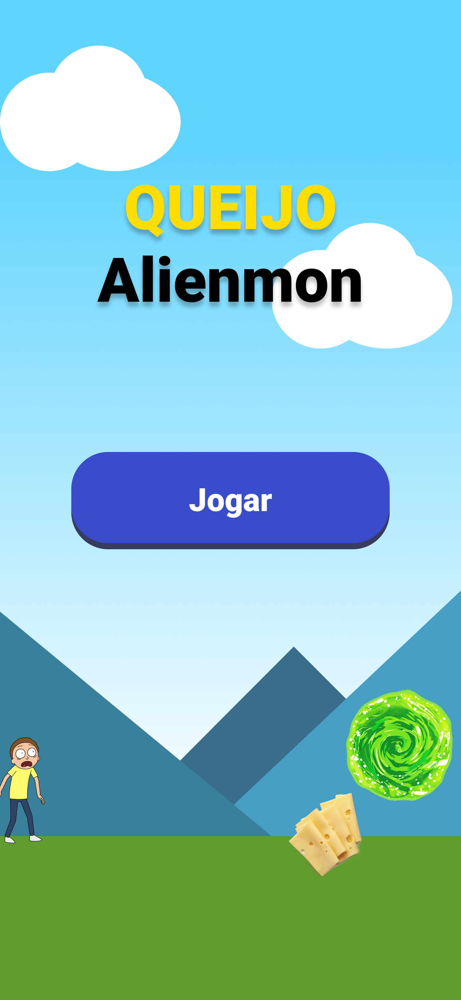
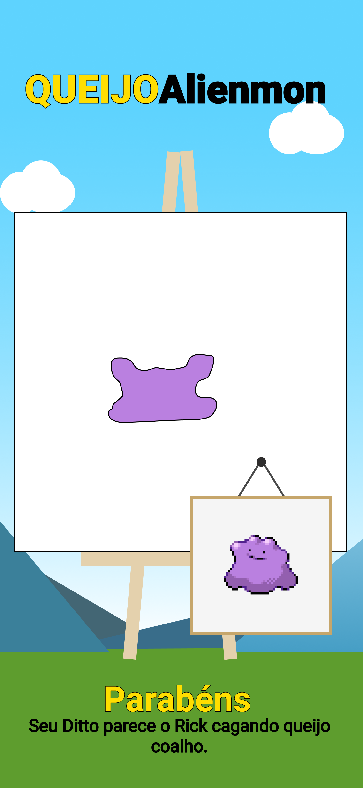

[![Contributors][contributors-shield]][contributors-url]
[![Commits][commits-shield]][commits-url]
[![Forks][forks-shield]][forks-url]
[![Stargazers][stars-shield]][stars-url]
[![Issues][issues-shield]][issues-url]

<!-- PROJECT LOGO -->
<br />
<p align="center">
  <a href="https://github.com/DaniloLira/Queijalienmon">
    
  </a>

  <h3 align="center">Queijalienmon</h3>

  <p align="center">
    O Queijalienmon é um aplicativo para reconhecimento de desenhos de pokémons
    <br />
    <a href="https://github.com/DaniloLira/Queijalienmon"><strong>Explore a documentação »</strong></a>
    <br />
    <br />
    <a href="https://github.com/DaniloLira/Queijalienmon">TestFlight</a>
    ·
    <a href="https://github.com/DaniloLira/Queijalienmon">Reporte Bug</a>
  </p>
</p>


<!-- TABLE OF CONTENTS -->
## Tabela de conteúdo

* [Sobre o projeto](#sobre-o-projeto)
* [Tecnologias utilizadas](#tecnologias-utilizadas)
* [Gitflow](#git-flow)


<!-- ABOUT THE PROJECT -->
## Sobre o projeto
O Queijalienmon é um aplicativo iOS voltado para deteccao de desenhos de pokemons utilizando inteligencia artificial. Utilizamos o coreML para criar um modelo de deteccao e reconhecer qual criatura o usuario desenhou. Esta aplicacao foi desenvolvida durante um challenge da Apple Developer Academy com o objetivo principal de desenvolver um conhecimento sobre as tecnologias utilizadas

| Inicio | Canvas |
|----------|----------|
|   |    |


### Tecnologias utilizadas
Aqui listamos as tecnologias utilizadas para a construção deste projeto
* [Swift](https://swift.org/)
* [CoreML](https://developer.apple.com/documentation/coreml)

<!-- MARKDOWN LINKS & IMAGES -->
<!-- https://www.markdownguide.org/basic-syntax/#reference-style-links -->
[contributors-shield]: https://img.shields.io/github/contributors/DaniloLira/Queijalienmon.svg?style=flat-square
[contributors-url]: https://img.shields.io/github/contributors/DaniloLira/Queijalienmon
[forks-shield]: https://img.shields.io/github/forks/DaniloLira/Queijalienmon.svg?style=flat-square
[forks-url]: https://img.shields.io/github/forks/DaniloLira/Queijalienmon
[commits-shield]: https://img.shields.io/github/last-commit/DaniloLira/Queijalienmon.svg?style=flat-square
[commits-url]: https://img.shields.io/github/last-commit/DaniloLira/Queijalienmon
[stars-shield]: https://img.shields.io/github/stars/DaniloLira/Queijalienmon.svg?style=flat-square
[stars-url]: https://img.shields.io/github/stars/DaniloLira/Queijalienmon
[issues-shield]: https://img.shields.io/github/issues/DaniloLira/Queijalienmon.svg?style=flat-square
[issues-url]: https://img.shields.io/github/issues/DaniloLira/Queijalienmon
[product-screenshot]: images/screenshot.png

<!-- Git Flow -->
## Git Flow

### Add new Feature or fix a Bug

1. Create your Feature or Fix Branch
  * `git checkout -b feature/AmazingFeature`
  * `git checkout -b fix/AmazingFix`
  * `git checkout -b test/AmazingTest`
2. Commit your Changes
  * `git commit -m 'Feature(AmazingFeature): Add some AmazingFeature`
  * `git commit -m 'Fix(AmazingFix): Fixes a bug`
  * `git commit -m 'Test(AmazingFeature): UI Button Test
3. Push to the Branch
  * `git push origin feature/AmazingFeature`
  * `git push origin fix/AmazingFix`
4. Open a Pull Request in Github's Pull request tab and fill it with the above Pull Request Template.
5. If the Pull Request is not able to merge automatically do the following steps while on your branch:
```sh
git pull develop
```
6. Solves conflicts in Xcode, and commit your changes
7. Add reviewers to your Pull Request and wait for approval.

## Pull Request Template
```sh
### Issue Name
**What I did:**

- First thing I did...

- Second thing I did...

**How to test:**

- Brief notes on how to check if the feature works correctly.
```
